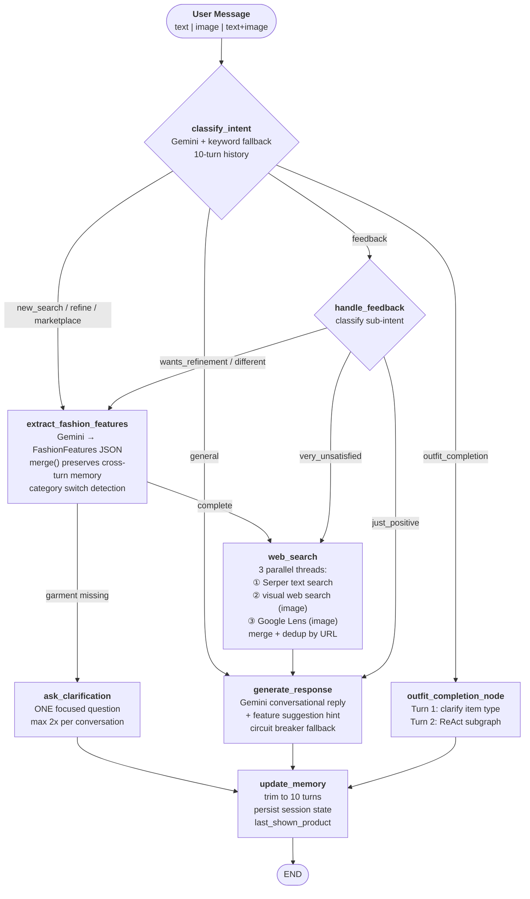
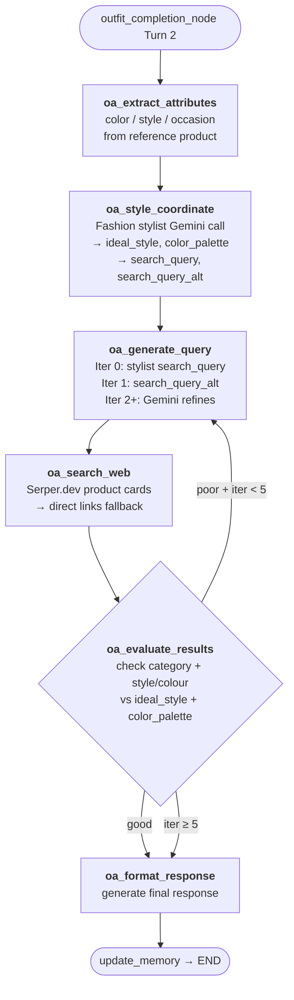

# AI Fashion Assistant — Production Workflow Design

## Architecture Summary

| Decision | Choice |
|----------|--------|
| Product search | Serper.dev (live web search + Google Lens) |
| Local DB search | Removed (FAISS/CLIP deleted) |
| Memory | Session only (10-turn rolling window) |
| Image in chat | Yes — multipart/form-data upload |
| Max turns | 10 (older messages dropped) |
| Feature extraction | Gemini → structured FashionFeatures JSON |
| Image hosting for Lens | catbox.moe (free, no auth required) |
| Validation | Pydantic throughout — all state fields typed |

---

## Full Graph Flow

```
User Input (text / image / both)
         ↓
  [ classify_intent ]  ← Gemini reads message + 10-turn history
         │                keyword fallback if Gemini unavailable
         │
         ├─ new_search / refine / marketplace_search
         │         ↓
         │  [ extract_fashion_features ]  ← Gemini structured JSON
         │         │      FashionFeatures.merge() preserves cross-turn attrs
         │         │
         │         ├─ garment missing? ──► [ ask_clarification ] ─► END (max 2x)
         │         │
         │         └─ complete ──────────► [ web_search ]
         │                                      │
         │                              ┌───────┼────────┐
         │                              ▼       ▼        ▼
         │                         Serper   visual   Google
         │                          text     web      Lens
         │                         search   search   search
         │                        (always) (image)  (image)
         │                              │       │        │
         │                              └───────┴────────┘
         │                                      │
         │                                merge + dedup
         │                                      │
         │                                      ▼
         │                           [ generate_response ]  ← Gemini
         │                                      │
         │                                      ▼
         │                            [ update_memory ]  ← trim to 10 turns
         │                                      │
         │                                     END
         │
         ├─ outfit_completion
         │         ↓
         │  [ outfit_completion_node ]
         │    Turn 1: ask clarifying question ──────────────────► [ update_memory ] → END
         │    Turn 2: invoke ReAct subgraph ───────────────────► [ update_memory ] → END
         │
         ├─ feedback_positive / feedback_negative
         │         ↓
         │  [ handle_feedback_node ]
         │    wants_refinement / wants_different ──► [ extract_fashion_features ]
         │    just_positive ────────────────────────► [ generate_response ]
         │    very_unsatisfied ────────────────────────► [ web_search ]
         │
         └─ general
                   ↓
           [ generate_response ]  ← no search triggered
```

---

## Full Mermaid Diagram



---

## ReAct Outfit Subgraph



---

## ChatState — All Fields

```python
class ChatState(TypedDict):
    # Conversation
    messages: List[dict]           # rolling 10-turn history
    session_id: str
    intent: str                    # classified intent
    session: dict                  # persistent: gender, budget, last_shown, disliked_features

    # Feature extraction
    features: FashionFeatures      # accumulated across turns
    image_bytes: Optional[bytes]   # uploaded image
    image_b64: Optional[str]       # base64 for Gemini Vision
    image_description: Optional[str]  # Gemini Vision output

    # Search
    search_params: dict            # query string for web_search
    web_results: List[dict]        # merged results from all 3 threads
    lens_results: List[dict]       # raw Google Lens results
    products_to_show: List[dict]   # product cards rendered in UI

    # Output
    response_text: str             # generated reply
    web_search_triggered: bool
    clarification_count: int

    # Outfit completion
    last_shown_product: dict       # reference product for ReAct
    outfit_state: OutfitState      # ReAct subgraph state
```

**Removed fields** (FAISS era — no longer exist):
- ~~`local_results`~~
- ~~`final_results`~~
- ~~`results_quality`~~

---

## Serper.dev Integration

### Text Search
```
query = "women boho beach dress under ₹1500 Myntra Ajio"
POST https://google.serper.dev/shopping
headers: { X-API-KEY: SERPER_API_KEY }
body: { q: query, gl: "in", num: 10 }
→ parse results → Gemini Vision thumbnail verification
```

### Google Lens
```
image_bytes → catbox.moe (POST fileupload) → public_url
POST https://google.serper.dev/lens
body: { url: public_url }
→ parse response["organic"] (NOT "visual_matches")
→ return product list
```

### News (for Trend Analyzer)
```
query = "fashion trends India 2026"
POST https://google.serper.dev/news
→ articles → Gemini extracts 6 TrendItem objects → 1hr cache
```

---

## Verified Platform Search URLs

| Platform | URL Pattern |
|----------|------------|
| Flipkart | `https://www.flipkart.com/search?q={quote_plus}` |
| Amazon | `https://www.amazon.in/s?k={quote_plus}` |
| Myntra | `https://www.myntra.com/search?rawQuery={quote_plus}` |
| Ajio | `https://www.ajio.com/search/?text={quote_plus}` |
| Meesho | `https://www.meesho.com/search?q={quote_plus}` |
| Nykaa | `https://www.nykaafashion.com/search?q={quote_plus}` |
| Snapdeal | `https://www.snapdeal.com/search?keyword={quote_plus}` |
