# AI Fashion Assistant — Production Workflow Design (v2)

## Confirmed Decisions
| Question | Answer |
|----------|--------|
| Web search | Gemini Grounding (text links, no scraping) |
| Memory | Session only (10 turns rolling window) |
| Image in chat | Yes — user can upload image inside chat |
| Max turns | 10 (older messages dropped) |
| Extra LLM node | Feature Extraction Node (Gemini extracts structured outfit attributes) |
| Validation | Pydantic throughout — all state fields typed and validated |

---

## Architecture Summary

```
User Input (text / image / both)
         ↓
  [ Input Router ]  ← detects modality, runs Gemini Vision for images
         ↓
  [ Classify Intent ]  ← Gemini reads last message + history (10-turn window)
         ↓
  ┌──────────────────────────────────────────────┐
  │  new_search / refine                          │
  │       ↓                                       │
  │  [ Extract Fashion Features ]  ← NEW NODE     │
  │       ↓                                       │
  │  [ Build Search Query ]                       │
  │       ↓                                       │
  │  [ Search Local DB ]  →  [ Rerank ]           │
  │       ↓                                       │
  │  [ Check Quality ]                            │
  │    ↙       ↓        ↘                        │
  │ good   mediocre    poor/empty                 │
  │  ↓      ↓               ↓                    │
  │         [ Ask Clarification ]  (max 2x)       │
  │         After 2x → web search                 │
  └──────────────────────────────────────────────┘
         ↓                          ↓
  [ Generate Response ]    [ Web Search Subgraph ]
                                    ↓
                           [ Generate Response ]
```

---

## Full Mermaid Diagram

```mermaid
flowchart TD
    START(["`**User Message**
    text | image | text+image`"]) --> input_router

    %% ── INPUT LAYER ──────────────────────────────────────────────────────
    input_router{"`**Input Router**
    Detect modality`"}

    input_router -->|text only| classify_intent
    input_router -->|image only| gemini_vision
    input_router -->|text + image| gemini_vision

    gemini_vision["`**Gemini Vision**
    Describe uploaded image →
    structured fashion description`"]
    gemini_vision --> encode_combined

    encode_combined["`**Encode Input**
    CLIP: text encoder + image encoder
    Hybrid embed: α×img + β×text`"]
    encode_combined --> classify_intent

    %% ── INTENT LAYER ─────────────────────────────────────────────────────
    classify_intent{"`**Classify Intent**
    Gemini reads message
    + 10-turn history`"}

    classify_intent -->|new_search| extract_features
    classify_intent -->|refine| extract_features
    classify_intent -->|feedback_positive| handle_feedback
    classify_intent -->|feedback_negative| handle_feedback
    classify_intent -->|general| generate_response

    %% ── FEATURE EXTRACTION ────────────────────────────────────────────────
    extract_features["`**Extract Fashion Features** ⭐ NEW
    Gemini extracts structured attributes:
    garment_type, color, pattern, style,
    fit, fabric, occasion, gender,
    price_range, sleeve_type, neckline
    → Updates UserPreferences Pydantic model
    → Merges with accumulated session prefs`"]

    extract_features --> build_query

    build_query["`**Build Search Query**
    Constructs optimal CLIP text query
    from extracted features.
    Example:
    'navy blue cotton slim fit kurta
    mandarin collar ethnic men casual'
    → Also builds FAISS filter params`"]

    build_query --> search_local_db

    %% ── SEARCH + RERANK ───────────────────────────────────────────────────
    search_local_db["`**Search Local DB**
    FAISS top-K
    with Pydantic-validated filters:
    category, price, brand, gender`"]

    search_local_db --> rerank

    rerank["`**Rerank Results**
    Gemini scores each result 0-10
    using extracted features as criteria
    (not just raw query string)`"]

    rerank --> check_quality

    %% ── QUALITY GATE ──────────────────────────────────────────────────────
    check_quality{"`**Check Quality**
    best_score ≥ 6?`"}

    check_quality -->|best ≥ 6 good| generate_response
    check_quality -->|best 3-5 mediocre| clarification_check

    clarification_check{"`**Clarification Counter**
    asked < 2 times?`"}

    clarification_check -->|yes ask| ask_clarification
    clarification_check -->|no 2x already| web_search_subgraph

    check_quality -->|best < 3 or empty| web_search_subgraph

    %% ── CLARIFICATION ─────────────────────────────────────────────────────
    ask_clarification["`**Ask Clarifying Question**
    Gemini picks ONE focused question
    based on which feature is missing:
    occasion? gender? budget? style?
    clarification_count += 1`"]

    ask_clarification --> WAIT(["`Wait for
    Next Message`"])

    %% ── FEEDBACK HANDLER ──────────────────────────────────────────────────
    handle_feedback{"`**Handle Feedback**
    Gemini classifies feedback type`"}

    handle_feedback -->|wants_refinement e.g. in blue| extract_features
    handle_feedback -->|wants_different fresh start| extract_features
    handle_feedback -->|just_positive no search| generate_response
    handle_feedback -->|very_unsatisfied 2x negative| web_search_subgraph

    %% ── WEB SEARCH SUBGRAPH ───────────────────────────────────────────────
    subgraph web_search_subgraph ["🌐  Web Search Subgraph  (Gemini Grounding)"]
        direction TB
        gen_queries["`**Generate Search Queries**
        Gemini creates 3-5 targeted queries
        using extracted FashionFeatures
        Examples:
        • 'blue kurta men under 1000 site:ajio.com'
        • 'ethnic blue cotton kurta myntra'
        • 'men casual blue kurta flipkart'`"]

        gen_queries --> grounding_search

        grounding_search["`**Gemini Grounding Search**
        Uses Gemini's built-in Google Search
        grounding to fetch real-time results.
        Returns: title, link, snippet, price`"]

        grounding_search --> format_web_results

        format_web_results["`**Format Web Results**
        Normalize to SearchResult schema
        Add source_site, product_url
        Pydantic validation`"]
    end

    format_web_results --> generate_response

    %% ── RESPONSE ──────────────────────────────────────────────────────────
    generate_response["`**Generate Response**
    Gemini writes reply with context:
    • What was searched
    • What was found (or not found)
    • Suggest next action if needed
    Tone adapts: excited / apologetic /
    conversational / helpful`"]

    generate_response --> update_memory

    %% ── MEMORY ────────────────────────────────────────────────────────────
    update_memory["`**Update Session Memory**
    Rolling 10-turn window
    Persist: UserPreferences,
    last_results, search_history,
    clarification_count`"]

    update_memory --> END(["`Return to User
    message + product cards / links`"])

    %% ── MEMORY READ (dashed) ──────────────────────────────────────────────
    session_memory[("`Session Memory
    10-turn rolling window
    UserPreferences
    search_history`")]

    session_memory -.->|restore prefs + history| classify_intent
    session_memory -.->|restore clarification count| clarification_check
    update_memory -.->|persist| session_memory

    %% ── STYLES ────────────────────────────────────────────────────────────
    classDef decision    fill:#fef3c7,stroke:#d97706,color:#000
    classDef action      fill:#f0fdf4,stroke:#16a34a,color:#000
    classDef newnode     fill:#ede9fe,stroke:#7c3aed,color:#000
    classDef endpoint    fill:#fdf2f8,stroke:#9333ea,color:#000
    classDef memorynode  fill:#e0f2fe,stroke:#0284c7,color:#000

    class check_quality,classify_intent,handle_feedback,input_router,clarification_check decision
    class encode_combined,search_local_db,rerank,ask_clarification,generate_response,build_query,gemini_vision,gen_queries,grounding_search,format_web_results,update_memory action
    class extract_features newnode
    class START,END,WAIT endpoint
    class session_memory memorynode
```



---

## Pydantic Data Models

All state fields are validated using Pydantic. No raw dicts in the graph.

```python
# ── Feature Extraction Output ─────────────────────────────────────────
class FashionFeatures(BaseModel):
    """Structured outfit attributes extracted by Gemini from conversation."""
    garment_type: Optional[str] = None      # "kurta", "dress", "jeans", "top"
    color: Optional[List[str]] = None        # ["blue", "navy"]
    pattern: Optional[str] = None           # "floral", "solid", "striped", "embroidered"
    style: Optional[str] = None             # "ethnic", "casual", "formal", "boho"
    fit: Optional[str] = None               # "slim", "regular", "relaxed", "oversized"
    fabric: Optional[str] = None            # "cotton", "silk", "denim", "linen"
    occasion: Optional[str] = None          # "wedding", "casual", "office", "beach"
    gender: Optional[str] = None            # "men", "women", "unisex"
    max_price: Optional[float] = None       # 1000.0
    min_price: Optional[float] = None       # 0.0
    brand: Optional[str] = None             # "H&M", "Fabindia"
    sleeve_type: Optional[str] = None       # "full", "half", "sleeveless", "puffed"
    neckline: Optional[str] = None          # "mandarin", "round", "v-neck", "sweetheart"

    def merge(self, other: "FashionFeatures") -> "FashionFeatures":
        """Merge new features into existing, never overwriting with None."""
        data = self.model_dump()
        for k, v in other.model_dump().items():
            if v is not None:
                data[k] = v
        return FashionFeatures(**data)

    def to_clip_query(self) -> str:
        """Build an optimal CLIP search string from extracted features."""
        parts = []
        if self.gender:       parts.append(self.gender)
        if self.garment_type: parts.append(self.garment_type)
        if self.color:        parts.extend(self.color)
        if self.pattern:      parts.append(self.pattern)
        if self.style:        parts.append(self.style)
        if self.fit:          parts.append(self.fit)
        if self.fabric:       parts.append(self.fabric)
        if self.occasion:     parts.append(f"for {self.occasion}")
        if self.sleeve_type:  parts.append(f"{self.sleeve_type} sleeves")
        if self.neckline:     parts.append(f"{self.neckline} neck")
        return " ".join(parts) if parts else "fashion item"

    def to_filters(self) -> dict:
        """Build FAISS filter dict."""
        f = {}
        if self.gender:       f["gender"] = self.gender
        if self.garment_type: f["category"] = self.garment_type
        if self.brand:        f["brand"] = self.brand
        if self.max_price:    f["max_price"] = self.max_price
        if self.min_price:    f["min_price"] = self.min_price
        return f


# ── Chat Message ──────────────────────────────────────────────────────
class ChatMessage(BaseModel):
    role: Literal["user", "assistant"]
    content: str
    image_included: bool = False


# ── Search Parameters ─────────────────────────────────────────────────
class SearchParams(BaseModel):
    query: str
    filters: dict = {}
    k: int = 12


# ── Web Search Result ─────────────────────────────────────────────────
class WebSearchResult(BaseModel):
    title: str
    url: str
    snippet: Optional[str] = None
    price: Optional[str] = None
    source_site: Optional[str] = None
    image_url: Optional[str] = None


# ── LangGraph State ───────────────────────────────────────────────────
class FashionChatState(TypedDict):
    # Conversation (10-turn rolling window)
    messages: List[dict]
    conversation_id: str

    # Input this turn
    input_type: str               # "text" | "image" | "hybrid"
    raw_query: Optional[str]
    image_bytes: Optional[bytes]
    image_description: Optional[str]   # Gemini Vision output
    query_embedding: Optional[List[float]]

    # Feature extraction
    current_features: dict        # FashionFeatures this turn
    user_preferences: dict        # Accumulated FashionFeatures across session
    search_params: dict           # SearchParams for this turn

    # Search results
    local_results: List[dict]
    final_results: List[dict]
    results_quality: str          # "good" | "mediocre" | "poor" | "empty"

    # Web search
    web_search_triggered: bool
    web_results: List[dict]       # List[WebSearchResult]

    # Intent / routing
    intent: str                   # "new_search"|"refine"|"feedback_positive"|"feedback_negative"|"general"
    feedback_action: str          # "text_response"|"update_search"|"web_search"|"clarify"

    # Clarification tracking
    clarification_count: int      # 0, 1, 2 — after 2, force web search

    # Response
    response: str
    products_to_show: List[dict]
```

---

## Node Specifications

### 1. `input_router`
- **Input**: raw message text + optional image bytes
- **Logic**: if image → call Gemini Vision first → then route
- **Output**: sets `input_type`, `image_description`, routes to correct encoder
- **Validation**: image max 10MB, supported types JPEG/PNG/WebP

### 2. `gemini_vision` *(only if image present)*
- **Input**: image bytes
- **Logic**: Calls `llm_service.describe_image()` (already built)
- **Output**: `image_description` — rich fashion description string
- **Feeds into**: CLIP text encoder + used by feature extractor

### 3. ⭐ `extract_fashion_features` *(new, most important node)*
- **Input**: latest message + `image_description` (if any) + conversation history
- **Logic**: Gemini extracts structured `FashionFeatures`
- **Key behaviour**: Merges new features into `user_preferences` using `FashionFeatures.merge()` — never loses previously mentioned attributes
- **Output**: `current_features` + updated `user_preferences`
- **Why separate from classify_intent?** Separation of concerns — intent = routing, features = search quality. Using one LLM call for both produces worse results.

### 4. `build_search_query`
- **Input**: `current_features` (merged with accumulated `user_preferences`)
- **Logic**: calls `FashionFeatures.to_clip_query()` and `FashionFeatures.to_filters()`
- **Output**: `SearchParams` Pydantic model with optimal CLIP query string + filter dict
- **Example**: `{query: "men blue cotton kurta regular fit casual", filters: {gender: "men", max_price: 1000}}`

### 5. `search_local_db`
- **Input**: `SearchParams` (Pydantic validated)
- **Logic**: CLIP encodes the query, FAISS top-K with filters
- **Output**: `local_results` list (raw dicts from FAISS)

### 6. `rerank`
- **Input**: `local_results` + `current_features` (used as scoring criteria, not raw query)
- **Logic**: Gemini re-ranks using feature-aware prompt (e.g. "does this match: blue, cotton, kurta, men, casual?")
- **Output**: sorted `final_results` with `llm_score`

### 7. `check_quality` *(conditional edge)*
- **Input**: `final_results`
- **Logic**: `best_score = max(r.llm_score for r in final_results)`
  - `≥ 6` → "good" → `generate_response`
  - `3–5` → "mediocre" → `clarification_check`
  - `< 3` or empty → "poor" → `web_search_subgraph`

### 8. `clarification_check` *(conditional edge)*
- **Input**: `clarification_count` from state
- **Logic**: count < 2 → ask question. count ≥ 2 → web search
- **Why max 2?** Asking questions indefinitely with no results is bad UX

### 9. `ask_clarification`
- **Input**: `user_preferences` gaps + last results quality
- **Logic**: Gemini identifies the single most impactful missing feature, generates ONE focused question
- **Output**: `response` = the question, `clarification_count += 1`

### 10. `handle_feedback` *(conditional edge)*
- **Input**: message + `final_results` shown last turn
- **Logic**: Gemini classifies into:
  - `wants_refinement` ("in red", "cheaper") → routes to `extract_features` with updated params
  - `wants_different` ("show something else entirely") → clears prefs, re-searches
  - `just_positive` ("love it!", "great") → routes to `generate_response`
  - `very_unsatisfied` ("these are all wrong", complained 2+ turns) → web search

### 11. `web_search_subgraph` *(Gemini Grounding)*
- **`generate_search_queries`**: Gemini uses `current_features.to_clip_query()` to create 3–5 site-targeted queries
- **`grounding_search`**: Gemini with `google_search_retrieval` tool enabled — fetches live results
- **`format_web_results`**: Normalizes to `WebSearchResult` Pydantic model — title, URL, snippet, price
- **Output**: `web_results` list (shown as clickable links, not image cards)

### 12. `generate_response`
- **Input**: `final_results` or `web_results` + intent + history
- **Logic**: Gemini generates contextual reply. Tone differs:
  - Good results: "Here are X items that match..."
  - Web results: "I searched online and found these links..."
  - No results: "I couldn't find this, try describing differently"
  - Positive feedback: "Glad you like them! Want me to find variations?"

### 13. `update_memory`
- Trims `messages` to last 10 turns (rolling window)
- Persists `user_preferences` (accumulated `FashionFeatures`)
- Resets `current_features`, `local_results`, `web_results` for next turn
- Increments/resets `clarification_count` as needed

---

## Edge Summary Table

| From | Condition | To |
|------|-----------|-----|
| `input_router` | has image | `gemini_vision` |
| `input_router` | text only | `classify_intent` |
| `gemini_vision` | always | `encode_combined` → `classify_intent` |
| `classify_intent` | `new_search` or `refine` | `extract_features` |
| `classify_intent` | `feedback_*` | `handle_feedback` |
| `classify_intent` | `general` | `generate_response` |
| `extract_features` | always | `build_search_query` |
| `build_search_query` | always | `search_local_db` |
| `search_local_db` | always | `rerank` |
| `rerank` | always | `check_quality` |
| `check_quality` | best_score ≥ 6 | `generate_response` |
| `check_quality` | best_score 3–5 | `clarification_check` |
| `check_quality` | best_score < 3 or empty | `web_search_subgraph` |
| `clarification_check` | count < 2 | `ask_clarification` |
| `clarification_check` | count ≥ 2 | `web_search_subgraph` |
| `handle_feedback` | `wants_refinement` or `wants_different` | `extract_features` |
| `handle_feedback` | `just_positive` | `generate_response` |
| `handle_feedback` | `very_unsatisfied` | `web_search_subgraph` |
| `web_search_subgraph` | always | `generate_response` |
| `generate_response` | always | `update_memory` → END |

---

## What Changes From Current v1 Code

| Current (v1) | Production (v2) |
|---|---|
| 3 nodes | 13 nodes + subgraph |
| No Pydantic in state | Full Pydantic: `FashionFeatures`, `SearchParams`, `WebSearchResult` |
| Intent + feature extraction mixed in one call | Separate `classify_intent` + `extract_fashion_features` nodes |
| Re-rank uses raw query string | Re-rank uses structured `FashionFeatures` as criteria |
| No quality gate | `check_quality` + `clarification_check` |
| No web fallback | Gemini Grounding subgraph |
| No image in chat | `gemini_vision` node handles chat image uploads |
| No preference accumulation | `FashionFeatures.merge()` accumulates across 10 turns |
| `clarification_count` not tracked | Max 2 clarifications before forcing web search |

---

## Files That Will Be Created / Modified

```
backend/
  app/
    schemas/
      chat.py              ← UPDATE: add FashionFeatures, SearchParams, WebSearchResult
    services/
      chat_service.py      ← REWRITE: full 13-node LangGraph graph
    api/endpoints/
      chat.py              ← MINOR UPDATE: handle image upload in chat

frontend/
  src/components/
    ChatAssistant.tsx      ← UPDATE: add image upload button in chat input
```

---

## Ready to Build?

Reply **"build it"** and I will implement this in order:
1. Pydantic schemas in `chat.py`
2. Rewrite `chat_service.py` with the full graph
3. Update `chat.py` endpoint to accept optional image
4. Update `ChatAssistant.tsx` with image upload in chat
